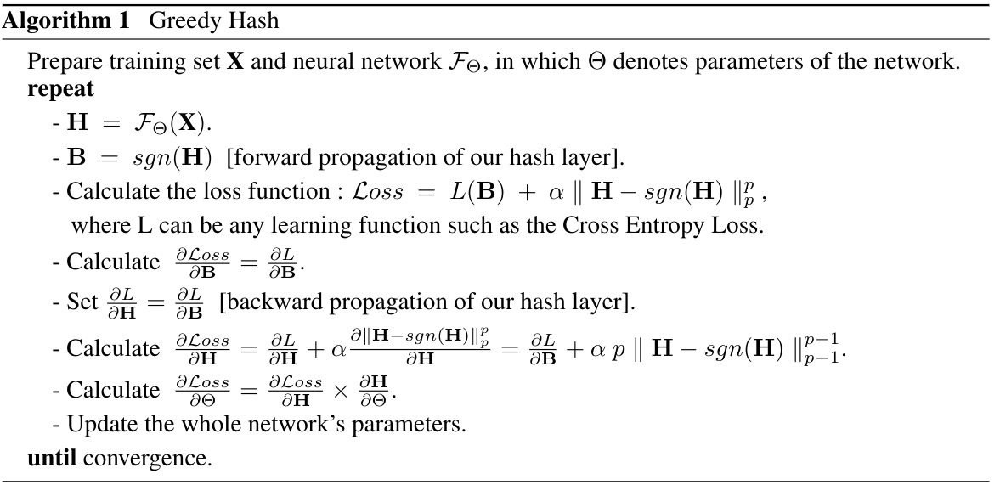

#图像检索

[toc]

# Greedy Hash: Towards Fast Optimization for Accurate Hash Coding in CNN
- 论文: https://proceedings.neurips.cc/paper/2018/hash/13f3cf8c531952d72e5847c4183e6910-Abstract.html
- 会议: NeurIPS 2018
- 代码: https://github.com/ssppp/GreedyHash

## 摘要
哈希在大规模图像索引中很有用.深度哈希的一个难点是,若对网络的输出施加离散约束,通常会出现 [NP-Hard](https://zhuanlan.zhihu.com/p/99515528) 问题导致难以优化.而本文则使用贪心原则来处理 NP-Hard 问题,在每个迭代中,都将网络向最优离散解的方向更新.我们设计了一个哈希编码层来实现这个方法,它在前馈过程中使用符号函数来保持这个离散约束,在反传时,直接将梯度整个传到前一层网络来避免梯度消失.(符号函数很多地方梯度是0).除了理论推导,我们还从一个新角度来可视化和理解我们算法的有效性和效率.实验证明 SOTA.

注: HP-Hard 问题即存在一个已知的 NPC 问题可以约化到本问题,但是本文问题不一定可以在多项式时间内验证一个解.

## 1. 引言
哈希很有用.

但 sign 函数对于所有非零输入的梯度是0导致端到端训练依然很难.过去多数工作在解决整个问题时都放宽了条件,即放弃了离散约束,使用 tanh 或者 sigmoid 来替代 sign 函数,或者在损失中添加一个正则项来逼迫生成的特征尽量离散化,然后在测试阶段在使用 sign 函数来获取真正的二进制码.由于网络的学习能力有限,这些方案都会引入一个可量化的误差导致得到的哈希码是次优的. HashNet 和 Deep Supervised Discrete Hashing 在这个问题上取得来一定进展. HashNet 在训练时使用平滑的激活函数 $y=tanh(\beta x)$,并通过增大 $\beta$ 的值使得函数变得没有那么平滑,来近似 sign 函数. DSDH 则尝试使用[坐标下降法(discrete cyclic coordinate descend,DCC)](https://zh.wikipedia.org/wiki/%E5%9D%90%E6%A0%87%E4%B8%8B%E9%99%8D%E6%B3%95)来解决这个问题,这样可以在整个优化过程中保持离散约束.

但这两者依然有缺陷.首先,它们都需要长时间的训练, DSDH 是一位位的来更新哈希码的,而 HashNet 则需要在每个迭代里都不断调节 $\beta$. 另外, DCC 只能用来解决二进制二次规划问题,应用范围有限,而 HashNet 则依然存在量化误差,因为 $\beta$ 不可能无穷大.为此,本文提出一个更快更有效的算法来将哈希编码和神经网络结合起来.

本文贡献:  
(1) 使用贪婪算法来快速解决哈希离散优化,设计一个新的编码层,该层在前馈阶段使用 sign 函数来避免量化误差,在反传阶段直接将梯度反传过去来避免梯度消失.
(2) 我们不仅提供来理论推导,还从 sign 函数聚集效应的角度触发,来可视化和解释本方法的有效性.
(3) 实验证明来我们方法 SOTA ,无论在监督还是无监督任务中.

## 2. CNN 的贪婪哈希
本节开始,我们将详细介绍本文方法,并引入一些符号备用.我们用 $H$ 表示原始网络最后隐藏层输出,这也是本文哈希编码层的输入. $B$ 代表哈希码,即哈希编码层输出.$sgn()$ 是 sign 函数.

### 2.1 使用贪婪算法来优化离散哈希
首先,让我们聚焦离散优化问题,其定义如下:
$$
\underset{B}{min} L(B),  
s.t. B \in \{-1,+1\}^{N \times K}   \tag{1}
$$
N 代表 N 个输入,K 表示 K 位编码.$L(B)$ 是我们要用的损失函数,可以是 MSE 或者交叉熵等等.

若我们不管离散约束 $B \in \{-1,+1\}^{N \times K}$, 旨在获取最优的连续的 $B$, 那么我们可以按照以下规则来更新 $B$ 直到其收敛:
$$
B^{t+1}=B^t-lr*\frac{\partial L}{\partial B^t}  \tag{2}
$$

这里 $t$ 代表第 $t$ 此迭代, $lr$ 是学习率.  

然而,在满足 $B \in \{-1,+1\}^{N \times K}$ 的条件下来计算$B$ 几乎是不可能的.在考虑离散约束的条件下,公式1 将变成一个 NP-Hard 问题.而可以有效处理 NP-Hard 之一的方法便是贪婪算法,即每次迭代时选择当前最优来最终逼近全局最优解.若是不考虑离散约束, $B^{t+1}$ 便是一个连续最优解,使用贪心原则,那么离其最近的离散解便是 $sgn(B^{t+1})$,这也很有可能是每次迭代的最优离散解,若是我们使用贪心算法来更新 $B$ 的话.由此,我们将使用以下等式来解决每个迭代的优化:
$$
B^{t+1}=sgn(B^t-lr*\frac{\partial L}{\partial B^t}  \tag{3}
$$

图1显示来公式3是如何收敛的.  

这和[文献27]()的结论是一致的,在文献27中,作者给出来严格的数学推导来证明公式3的可收敛性(使用非凸和非平滑优化理论.).与文献27不同的是,我们更加关注公式3(贪婪选择)背后的意义,以及我们接下来将其与神经网络结合时的一些特性.

我们相信公式3并非最有效的解决离散优化的方法,但它确实是考虑离散约束时,和神经网络结合的最佳选择.理由如下:

1. 神经网络本身就是依赖使用贪心策略的梯度差来更新网络的,这证明来使用贪心算法来解决神经网络优化问题是高度可行的.
2. 公式3和神经网络更新模式相同,都是计算梯度然后更新参数
3. 文献9指出,SGD会在全局梯度是引入噪声,但是这些噪声不仅起到来正则化的效果,还能帮助网络避开一些局部最小值或者鞍点.

因此,公式3是合理且有效的解决神经网络离散哈希问题的方法.

### 2.2 使用新的哈希层来反向传播编码信息
2.1节我们讨论来为何选择公式3来解决神经网络离散优化问题.本节,我们将展示如何通过一个新的,精心设计的哈希层,将公式3应用到网络的训练过程中.

首先,引入一个符哈 $H$ ,将公式3改写成以下形式:
$$
\begin{cases} 
    B^{t+1}=sgn(H^{t+1}), & \text{(4a)} \\ 
    H^{t+1}=B^t-lr* \frac
    {\partial L}{\partial B^t}, & \text{(4b)} 
\end{cases}
$$

这里 $H$ 是神经网络输出,$B$ 是哈希码,我们将设计一个新的层,将 $H$ 和 $B$ 联系起来,并满足公式4a和4b.

根据公式4a,在前馈过程中,我们只需简单的应用 sign 函数即可.  

对于公式4b,若我们在目标函数中添加一个正则项$||H-sgn(H)||^p_p$,并使之趋于0,结合公式4a,可得:
$$
\begin{align}
H^{t+1} =& H^t-lr*\frac{\partial L}{\partial H^t} \\
=& (H^t-B^t)+B^t-lr* \frac{\partial L}{\partial H^t} \\
=& (H^t-sgn(H^t))+B^t-lr* \frac{\partial L}{\partial H^t}  \\
\approx& B^t - lr *\frac{\partial L}{\partial H^t}  \tag{6}
\end{align}
$$

结合公式4a和5,我们可以发现:
$$
\frac{\partial L}{\partial H^t}=\frac{\partial L}{\partial B^t}  \tag{6}
$$
这意味着直接将B的梯度传给H就行.综上,本文算法流程如下:

### 2.3 可视化本文算法有效性
本节,我们提供了一个新的角度来可视化和理解本文算法的连个重要模块:
$$
\begin{align}
    Forward:& B=sgn(H),  \tag{7} \\
    Backward:& \frac{\partial L}{\partial H}=\frac{\partial L}{\partial B}
\end{align}
$$

首先,我们假设输入有两类输入图片.我们设 $H=(h1,h2)$ 和 $B=(b1,b2)$,这意味着我们仅需要两位来编码输入图片.

如之前介绍,多数哈希方法都是使用 tanh 来近似 $sgn()$ 或添加正则项,而这些方法都会倾向于产生一堆连续值,这会违反离散约束.这样导致一些样本不会被严格的聚集起来,如图2b左侧,这就导致了在测试阶段,使用 sign 函数产生的二进制码分布和在训练阶段时,两者分布不完全一致,如图2b右侧.这就是我们所说的量化误差.而在我们提出的哈希层中,sign 函数(公式7)将被直接应用在训练阶段,没有任何的松弛.这使得训练样本可以被严格的聚集,loss 函数可在测试阶段前准确并实时反映出差异,并将样本映射到正确的位置.  

在反传阶段应用公式8可以有效解决梯度消失问题.为了传播 $\frac{\partial L}{\partial B}$ 到 $\frac{\partial L}{\partial H}$ 的移动信息(用于每个样本的更新方向),我们直接将 B 的梯度传给 H,因为sign 函数的聚集效应不会给变样本从 H 到 B的象限.这样原本误分类的样本将会得到正确的移动方向,图2a中红色部分.即公式8使得 H 可以实时获取损失函数希望 B 移动的方向,进而帮助我们网络更好的收敛.

BTW,尽管一些早期关于随机神经元的研究曾提及过类似公式8的直通策略,但本文详细研究了其推导过程并将之应用在深度哈希编码领域.通过在损失函数中添加 $||H-sgn(H)||^p_p$ 正则项来使公式8成立(之前工作未提及),这对于减少 H 到 B 的梯度偏差是不可忽略的.

## 3. 实验
### 3.1 数据集
略
### 3.2 实现细节
**基础设置**   
batch size 32,优化器是 SGD,梯度衰减为0.0005,动量 0.9.对于监督学习我们设置0.001为初始学习率,而无监督学习初始学习率为0.0001,每次 loss 不再下降就变为原来 1/10.对于 Cifar-10,最终交叉验证中,正则项 $\alpha || H-sgn(H)||^p_p$ 中 $p=3$,$\alpha = 0.1 \times \frac{1}{N \cdot K}$ (这里$\frac{1}{N \cdot K}$可以去除编码常去和输入大小的影响),对于 ImageNet, $\alpha=1 \times \frac{1}{N \cdot K}$.

**监督学习设置**   
使用交叉熵损失函数,即仅仅使用 softmax 来分类 B 是 +1 还是 -1,没有使用任何的索引 loss(对比 loss 或 三元组 loss).使用 AlexNet 作为预训练模型,然后添加一个 fc 层来生成固定长度的特征,然后添加一个哈希层来产生二进制编码.

**无监督学习设置**  
受文献12启发,当特征编码空间从欧式空间变到汉明空间,我们选择最小化余弦相似度关系的差异.即 $L=||cos(h_1,h_2)-cos(b_1,b_2)||_2^2$,这里 $cos$ 就是余弦相似度,$h$ 是欧式空间的特征, $b$ 是汉明空间的特征.预训练模型使用VGG16,之后添加一个fc层和哈希层.

后略

