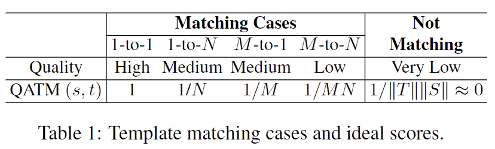

#模板匹配

[TOC]

# QATM: Quality-Aware Template Matching For Deep Learning

## 摘要
我们提出的QATM是可训练的,可以轻易插入其他深度学习网络.我们评价匹配对的质量( quality )是使用软排名,因此针对不同的匹配场景,比如1对1,1对N,N对N,这个 quality 的值是不同的.和传统方法的对比实验显示了, QATM SOTA.

## 1. 引言
经典的匹配方法是计算平方差值和或者是归一化互相关系数,这些方法对非刚性变化,遮挡,颜色漂移不鲁棒.  
基于深度学习的方法常常是简单的使用张量点乘( numpy.tensordot ).    
而本文提出的 QATM 则可以像一般模板匹配方法那样使用,而且可以用于其他深度网络中.它将考虑匹配的唯一性而不仅仅是匹配分数.
章节2讨论了QATM的思路.章节3将QATM和经典模板匹配方法比较.章节4将其应用到语义图像对齐和图像到GPS验证的问题.章节5展望.

## 2. Quality-Aware Template Matching
### 2.1. 动机
在很多视觉任务中,其实都或多或少的使用了模板匹配.无视各个领域算法细节,我们这里仅仅讨论一般的模板匹配.   
一个已知的问题是,在多数TM任务里,模板图的所有像素或者特征以及目标图片的候选框都被考虑在内.但这在很多情况下是不可取的,因为模板图片和目标图片之间的背景可能不相同.为了克服这个问题,BBS 通过最近邻域匹配( NN )的方法使得背景像素在匹配中不起作用.在BBS 之上,DDIS 在 NN 区域添加额外变形信息来提升匹配性能.  
与以往工作不同,我们考虑了5种不同的TM场景,如表1.  
   
设定 t 表示模板图像T, s 表示搜索图像S. 1-to-1 表示完全匹配, 1-to-N 和 M-to-1 表示 s 或 t 中存在相似的图像块(比如内容是天空或者地毯,那么图像块都是相似的), M-to-N 表示 s 和 t 中都有很多相似的图像块.在这四种匹配上的情景中,只有 1-to-1 匹配上是高质量的.因为其他三种情况下,就算匹配上的对有很高相似度,但是依然存在很多匹配候选,这表明匹配对的独一性就没有那么强了.   
显然, 1-to-1 匹配是最重要, not-matching 是最没用的.因此对各种匹配情况进行定理评价.那么通过寻找最大化的所有匹配模式下的最大质量,就可以找到 S 上的最佳匹配区域.公式1 展示了我们如何对匹配对进行定量评估

$$
R^*=arg max \{ \sum_{r \in R}max \{ Quality(r,t)|t \in T \} \}  \tag{1}
$$

这里 S 中 能使整体匹配质量最大化的 区域 R 就是最佳匹配区域. R 是固定尺寸大小的候选窗,实验中,我们将使用 object 的大小作为候选框.

### 2.2. 具体方法
在 TM 任务中使用公式1,我们需要定义 s 和 t 之间的质量 Quality(s,t).后续章节中,我们将引出质量感知的模板匹配度量方法(QATM),这是 Quality(s,t) 的一个代理函数.  
设 $f_s$ 和 $f_t$分别为图像片 $s$ 和 $t$ 的特征图, $\rho( \cdot )$表示两个图片的相似度.给定搜索图片 $s$,那么模板图片 $t$ 满足下列条件则是可匹配上的:
$$
L(t|s)=\frac { exp\{\alpha \cdot \rho(f_t,f_s)\} } { \sum_{t^{'} \in T} exp \{\alpha \cdot \rho(f_{t^{'}},f_s) \}}     \tag{2}
$$  
这里 $\alpha$ 是一个正值,作用待会讨论.这个似然函数(公式2)可以视为模板 $t$ 和所有匹配图像块匹配日质量的一个软排序.其实就是一个带了一个可学习参数的softmax.这里可学习参数就是$\alpha$.  
然后我们这里简单的将 QATM 度量定义为 $s$匹配到$T$和$t$匹配到$S$ 似然函数的乘积:   
$$
QATM(s,t)=L(t|s) \cdot L(s|t)
$$
对于相似度$\rho( \cdot )$,当$f_t$和$f_s$相似的时候应该尽量高.

