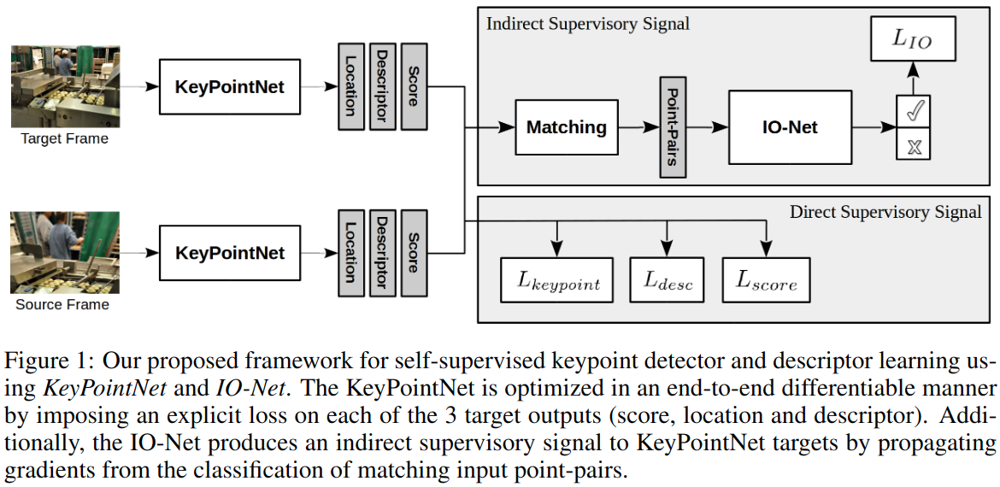

#无监督 #单应性估计 #图像配准

[toc]

# Neural Outlier Rejection For Self-supervised Keypoint Learning

## 摘要
问题: 使用自然图像,生成一致且精确的,针对感兴趣点的训练数据比较难
解决方法: 
1. 引入了 IO-Net, 用来做自监督的关键点检测,描述和配对
2. 引入了 KeyPointNet,主要用来做关键点检测和描述

We design the network toallow local keypoint aggregation to avoid artifacts due to spatial discretizationscommonly used for this task, and we improve fine-grained keypoint descriptorperformance by taking advantage of efficient sub-pixel convolutions to upsam-ple the descriptor feature-maps to a higher operating resolution.

## 引言
贡献:
1. 引入 IO-Net.使用neurally-guided outlier-rejection scheme 作为辅助任务. While the keypoint network is fully self-supervised, the net-work is able to effectively learn distinguishable features for two-view matching,  via the flow ofgradients from consistently matched point-pairs.

2. 引入 KeyPointNet.在 UnsuperPoint 上改进了两点.
First, we allow the keypoint location head to regress keypoint locations outside their corresponding cells, enabling keypoint matching near and across cell-boundaries. 
Second, by taking advantage of subpixel convolutions to interpolate the descriptor feature-maps to a higher resolution, we show that we areable to improve the fine-grained keypoint descriptor fidelity and performance especially as they retain more fine-grained detail for pixel-level metric learning in the self-supervised regime.

## 相关工作
比较亮眼的工作是2019年的 UnsuperPoint.该工作在每个 cell 内预测一个点.但是我们发现这个并非最优方案,尤其点临近 cell 的边界.Self-Improving Visual Odometry首次使用 CNN 来估计2D 关键点,并基于逆反射设计了一堆方法来分辨关键点的稳定性,以此作为信号来训练模型.因为这个不是可微的,所以没法实现 end2end. 而本文的 IO-Net 是可微的,且显示的使用了一个额外的代理监督信号来匹配关键点对,关键点对是  KeyPointNet 识别出来的.

>
>KeyPointNet 设计了一个显式的 loss,利用 score,location,descriptor 来进行端到端的训练.而 IO-Net 则通过输入点对的结果来间接指导 KeyPointNet.

## 自监督关键点学习
我们目的是回归一个函数,这个函数以一张图片为输入,以关键点,点的描述符以及置信度作为输出,这里我们定义这个函数为 $K:I \to \{p,f,s\}$. 图片为 $I \in R^{3*H*W}$,关键点为 $p=\{[u,v]\} \in R^{2*N}$, 描述符为 $f \in R^{256*N}$,关键点的置信度 $s \in R^N$,这里 $N$ 为关键点是数量,和输入图片的分辨率有关.$P$ 表示整张图片提取出来的关键点,$p$表示单个关键点.

## 相关论文
1. https://github.com/vislearn/ngransac
2. https://arxiv.org/abs/1907.04011
3. http://www.liuxiao.org/2020/04/%E8%AE%BA%E6%96%87%E7%AC%94%E8%AE%B0%EF%BC%9Aunsuperpoint-end-to-end-unsupervised-interest-point-detector-and-descriptor/
